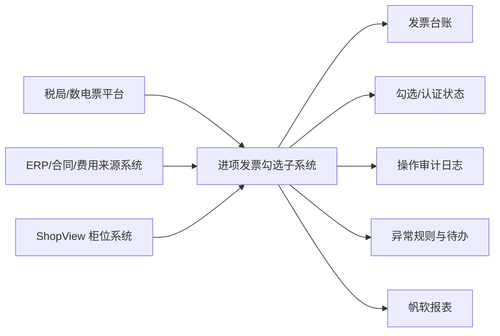

# 数电票进项发票勾选功能建设方案

## 1. 结论

建议采用：

**单独建设“进项发票勾选子系统”，并在 ShopView 中提供入口，在帆软中承接分析报表。**

不建议把“发票勾选”直接做成 ShopView 的核心业务模块，也不建议把“勾选作业流程”直接做在帆软里。

---

## 2. 当前 ShopView 的系统边界

从现有代码和菜单结构看，ShopView 当前更像：

- 柜位/楼层/经营单元管理系统
- 商户、合同、账单管理系统
- 经营分析与基础财务展示系统

现有“财务管理”更偏：

- 账单管理
- 财务报表
- 经营收益分析

而不是：

- 税务申报作业平台
- 发票认证状态管理平台
- 面向税局平台的高审计流程系统

因此，“进项发票勾选”与 ShopView 有关联，但不是同一个核心业务域。

---

## 3. 三种方案对比

### 方案 A：做在 ShopView 里

适合前提：

- 发票数据几乎全部来自柜位租赁、商户结算、供应商费用
- 使用人员与 ShopView 权限体系高度重合
- 只需要轻量台账和简单勾选辅助，不涉及复杂税务流程

优点：

- 用户入口统一
- 可复用现有账号、门店、部门权限
- 能快速和合同、供应商、账单关联

缺点：

- 税务作业和柜位业务强耦合
- 后期容易把系统做成“大而杂”
- 发票认证、红冲、作废、期间锁定、审计留痕会显著抬高系统复杂度
- 后面如果别的业务也要用发票能力，会发现 ShopView 变成了不合适的载体

结论：

**不建议作为主方案。**

---

### 方案 B：单独开发一套发票勾选系统

适合前提：

- 发票管理是独立财务作业
- 后续可能服务多个系统
- 需要更清晰的审计、权限、流程和接口边界

优点：

- 业务边界最清楚
- 税务流程可独立演进
- 更适合做高权限控制、操作留痕、状态流转
- 后续可同时对接 ShopView、报表系统、ERP/财务系统

缺点：

- 初期要多一套系统
- 需要做用户集成、菜单入口、数据同步
- 短期建设成本高于“直接塞进现有系统”

结论：

**推荐作为主方案。**

---

### 方案 C：做在帆软报表系统里

适合前提：

- 需求主要是查询、统计、对账、汇总、提醒
- 不涉及完整业务流程

优点：

- 报表展示快
- 财务人员容易上手
- 汇总分析、异常清单、期间统计很合适

缺点：

- 不适合承接核心业务操作流程
- 勾选、回写、撤销、审核、状态流转做起来会别扭
- 审计与流程控制能力通常不如专门业务系统
- 以后维护会混淆“报表平台”和“作业平台”的边界

结论：

**适合作为分析展示层，不适合作为主业务系统。**

---

## 4. 推荐架构

推荐职责划分：

- ShopView
  - 提供菜单入口
  - 提供供应商、合同、门店、部门、费用归属等业务主数据
  - 只做发票业务的来源关联，不承接税务作业主流程

- 发票勾选子系统
  - 发票采集/导入
  - 发票台账管理
  - 勾选/确认/撤销/认证状态流转
  - 期间控制
  - 红冲/作废/异常处理
  - 审计日志
  - 权限控制

- 帆软
  - 勾选率统计
  - 税额汇总
  - 门店/部门/供应商分析
  - 异常发票清单
  - 月度认证结果报表

---

## 5. 数据流建议

### 5.1 主数据流

- ShopView 输出：
  - 门店
  - 部门/柜组
  - 供应商
  - 合同
  - 账单/费用归属信息

- 发票系统保存：
  - 发票头信息
  - 发票明细
  - 勾选状态
  - 认证状态
  - 归属组织
  - 操作人和操作时间

- 帆软消费：
  - 发票事实表
  - 勾选结果表
  - 认证结果表
  - 异常清单表

### 5.2 操作流

1. 发票进入发票系统
2. 系统按供应商/门店/费用类型自动匹配归属
3. 财务人员勾选待认证发票
4. 系统记录状态变化与审计日志
5. 结果回写报表层
6. 帆软进行统计、对账、预警

---

## 6. 为什么不建议直接做进 ShopView

核心原因不是“能不能做”，而是“值不值得把复杂度放进去”。

如果把发票勾选做到 ShopView 里，后面通常会继续长出这些能力：

- 税期控制
- 勾选批次
- 发票异常池
- 红冲链路
- 认证结果回执
- 财务复核
- 操作追溯
- 与税局平台接口容错

这些能力一旦进入主系统，柜位系统的职责边界会明显变差，后续维护成本会上升。

---

## 7. 实施建议

### 第一阶段：最小可用版本

- 单独建发票勾选子系统
- 先支持发票导入、台账、勾选、状态记录、基础查询
- ShopView 只做入口跳转和主数据同步
- 帆软只做基础统计报表

### 第二阶段：完善流程

- 增加认证结果管理
- 增加异常处理与红冲场景
- 增加期间锁定与审批
- 增加供应商和费用归属自动匹配规则

### 第三阶段：系统联动

- 与 ERP/财务系统打通
- 与税局平台或中间平台做稳定集成
- 将报表、对账、预警全部沉淀到帆软

---

## 8. 最终建议

如果你现在要兼顾：

- 短期可上线
- 中期不返工
- 财务合规可控

那么最合适的方案是：

**“ShopView 挂入口 + 单独发票勾选子系统承接业务 + 帆软承接报表分析”**

这是三者里边界最清楚、后续最稳、返工概率最低的方案。

---

## 9. 一句话决策规则

如果一个功能在脱离柜位管理后依然独立成立，并且主要服务财务流程与税务合规，那它就不应该直接长在 ShopView 主体里。
