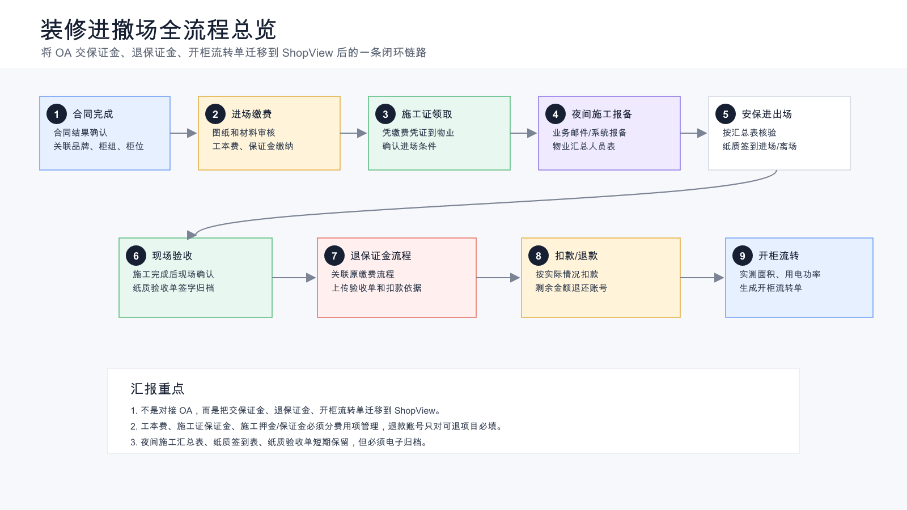
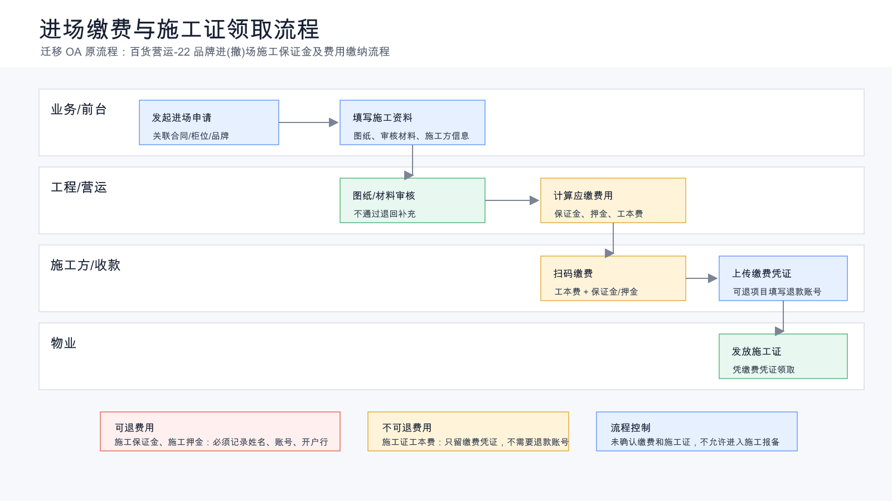
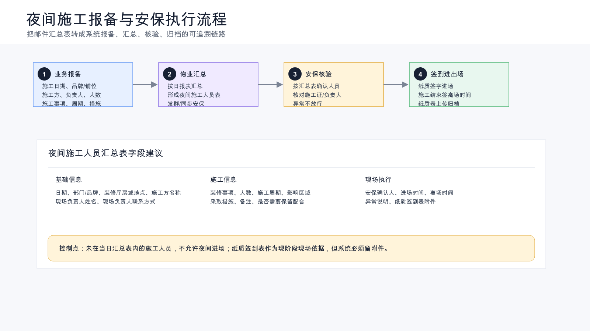
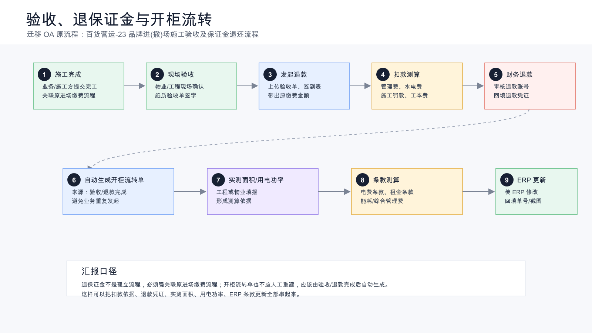

# 装修进撤场流程建设方案汇报稿（一稿）

## 1. 汇报目标

本次汇报主要说明装修流程从合同完成后开始，如何将 OA 中的交保证金流程、退保证金流程、开柜流转单流程迁移到 ShopView，并在 ShopView 中形成一条完整闭环，覆盖保证金缴纳、施工证领取、夜间施工报备、安保进出场、现场验收、退保证金、开柜流转和 ERP 条款更新。

当前重点不是对接或承接 OA，而是把 OA 里的相关流程迁移到 ShopView，由 ShopView 作为新的主流程系统，把业务填报、物业执行、安保登记、财务退款和 ERP 后续调整串成一条可追溯的业务链路。

## 2. 当前业务现状

目前装修相关工作分散在 OA、线下纸质单据、邮件、微信群和 ERP 中。其中交保证金、退保证金、开柜流转单在 OA 内发起和审批，物业执行、安保登记、纸质验收和夜间施工汇总仍在线下完成。

合同流程完成后，业务人员需要发起装修保证金缴纳流程。流程中需要填写图纸、审核材料、施工单位信息和施工押金打款凭证。随后业务人员带施工人员到营运扫码付款，费用主要包括施工证工本费和施工保证金。其中施工保证金、施工押金后续需要退款，所以必须登记退款姓名、账号和开户行；施工证工本费不退款，不需要退款账号。

缴费完成后，业务人员带施工人员凭缴费凭证到物业领取施工证。之后业务人员通过邮件向物业报备夜间施工安排。物业每天汇总夜间施工人员表并发到群里，安保晚上根据汇总表核验施工人员，安排纸质签到进场，施工结束后再签离场时间。

施工结束后，现场进行验收并签纸质验收单。随后业务人员发起退施工保证金流程，将纸质验收单、签到表等附件上传。物业、财务根据实际情况扣除管理费、水电费、施工罚款等费用，剩余金额退还。退保证金流程完成后，再根据实际测量面积和用电功率生成开柜流转单，测算后传给 ERP 修改电费条款、租金条款等。

## 3. 现状问题

第一，流程割裂。交保证金、退保证金、开柜流转单在 OA 中流转，但物业执行、安保登记、纸质验收和 ERP 修改之间缺少统一主线。

第二，重复录入。退保证金时需要重新关联原缴费金额、施工单位和退款账号，容易出现漏填、错填。

第三，线下单据不可追溯。夜间施工汇总表、安保签到表、纸质验收单主要靠人工保存，后续追查和统计困难。

第四，费用口径不够清晰。施工证工本费、施工证保证金、施工押金、施工保证金需要分开管理，否则退款和扣款时容易混淆。

第五，开柜流转和 ERP 修改容易漏单。施工验收、退保证金和 ERP 条款修改之间如果没有自动触发关系，后续需要人工跟进。

## 4. 建设思路

建议将装修进撤场流程定义为 ShopView 中的一条主业务链路。

整体链路如下：

1. 合同完成
2. 装修进场申请
3. 图纸和材料审核
4. 保证金及费用缴纳
5. 施工证领取
6. 夜间施工报备
7. 安保核验进出场
8. 现场验收
9. 退保证金
10. 开柜流转
11. ERP 条款更新

对应汇报图：

## 5. 进场缴费与施工证领取

进场阶段迁移 OA 原流程：百货营运-22、品牌进(撤)场施工保证金及费用缴纳流程。

建议在 ShopView 中将该阶段拆成三个关键动作：

第一，业务发起进场申请。系统带出合同、品牌、柜组、柜位、供应商等基础信息，业务补充施工单位、现场负责人、施工人数、施工日期、图纸和审核材料。

第二，营运、工程或物业完成图纸和材料审核。审核不通过时退回业务补充；审核通过后计算应缴费用。

第三，业务上传缴费凭证，物业确认后发放施工证。

费用项需要分开管理：

| 费用项 | 是否退款 | 是否需要退款账号 | 说明 |
| --- | --- | --- | --- |
| 施工证工本费 | 否 | 否 | 只保留缴费凭证 |
| 施工证保证金 | 是 | 是 | 后续按实际情况退还 |
| 施工押金 | 是 | 是 | 需记录姓名、账号、开户行 |
| 施工保证金 | 是 | 是 | 退保证金流程核心费用 |
| 围挡及其他费用 | 视规则 | 视规则 | 按费用性质配置 |

对应汇报图：

## 6. 夜间施工报备与安保执行

夜间施工目前主要靠邮件、微信群和纸质签到表执行。第一阶段不建议强行取消线下表单，而是先做到系统报备、自动汇总和电子归档。

建议流程：

1. 业务人员在系统中填写夜间施工报备。
2. 系统按日期生成夜间施工人员汇总表。
3. 物业确认后同步给安保。
4. 安保根据汇总表核验施工人员。
5. 施工人员纸质签到进场，施工结束后签离场时间。
6. 安保或物业上传纸质签到表附件。

夜间施工报备字段建议包括：

| 类别 | 字段 |
| --- | --- |
| 基础信息 | 日期、部门、品牌、铺位、装修厅房或地点 |
| 施工信息 | 施工方名称、现场负责人、联系方式、施工事项、人数、施工周期 |
| 风险控制 | 影响区域、采取措施、备注、是否需要保留配合 |
| 安保执行 | 进场时间、离场时间、安保确认人、异常说明、纸质签到表附件 |

核心控制点：未在当日汇总表中的施工人员，不允许夜间进场。

对应汇报图：

## 7. 现场验收、退保证金与开柜流转

退保证金阶段迁移 OA 原流程：百货营运-23、品牌进(撤)场施工验收及保证金退还流程。

退保证金流程必须强关联原进场缴费流程，系统自动带出原缴费项目、缴费金额、施工单位和退款账号，避免业务重复录入。

建议流程：

1. 施工完成后，业务或施工方提交完工。
2. 物业、工程现场验收，签纸质验收单。
3. 业务发起退保证金申请，上传纸质验收单、签到表和其他附件。
4. 物业或工程填写扣款依据。
5. 财务审核退款金额和退款账号。
6. 财务付款后回填退款凭证。
7. 退款完成后，系统自动生成开柜流转单。
8. 工程或物业填写实测面积和用电功率。
9. 财务或相关部门测算电费条款、租金条款。
10. 传 ERP 修改条款，并回填 ERP 修改结果。

扣款项建议至少支持：

| 扣款项 | 说明 |
| --- | --- |
| 管理费扣款 | 按施工天数或约定标准计算 |
| 水电费扣款 | 按实际用电或估算口径计算 |
| 施工罚款 | 根据违规记录和处罚依据扣款 |
| 装修指引工本费 | 如存在，应与可退保证金区分 |
| 其他扣款 | 支持上传扣款依据 |

对应汇报图：

## 8. ShopView 需要建设的能力

第一，装修项目主档。每一次装修对应一个装修项目，贯穿申请、缴费、报备、施工、验收、退款和开柜流转。

第二，费用明细管理。所有费用按项目拆分，区分是否可退、是否需要退款账号、是否已缴、是否已退。

第三，轻量流程审批。支持固定流程节点、同意、驳回、退回、审批意见、附件上传和待办提醒。

第四，夜间施工汇总。支持按日期、部门、品牌、施工方自动生成夜间施工人员汇总表。

第五，纸质单据归档。保留纸质签到和纸质验收，但系统必须要求上传附件。

第六，保证金退款闭环。退保证金流程自动关联原缴费流程，支持扣款、退款、凭证回填。

第七，开柜流转自动触发。验收或退款完成后自动生成开柜流转单，减少漏单。

第八，ERP 修改留痕。记录 ERP 修改内容、单号、截图或回传结果。

## 9. 分阶段实施建议

第一阶段，先做流程闭环和台账。

- 装修项目主档
- 进场缴费流程
- 费用明细
- 夜间施工报备
- 验收和退保证金流程
- 附件归档
- 开柜流转单

第二阶段，补充现场执行能力。

- 安保移动端核验
- 施工巡检
- 违规整改
- 扣款自动计算
- 汇总统计报表

第三阶段，再考虑深度集成。

- 企业微信待办提醒
- ERP 自动回写
- OA 原流程数据归档或历史查询
- 电子签名或无纸化验收

## 10. 需要领导确认的事项

第一，交保证金、退保证金、开柜流转单是否确定从 OA 迁移到 ShopView，由 ShopView 作为新主流程系统。

第二，夜间施工是否允许第一阶段继续使用纸质签到，但要求系统上传归档。

第三，施工证工本费、施工证保证金、施工押金、施工保证金是否按独立费用项管理。

第四，退保证金完成后是否自动触发开柜流转单。

第五，ERP 条款修改是由系统自动接口同步，还是第一阶段先由业务上传修改结果留痕。

## 11. 建议汇报口径

这次建设的重点不是把 OA 表单原样复制到 ShopView，而是把 OA 中的交保证金、退保证金、开柜流转单迁移出来，并解决装修流程中长期存在的断点问题。

我们希望通过一个装修项目，把合同结果、进场缴费、施工证、夜间施工、安保签到、现场验收、退保证金、开柜测算和 ERP 条款更新全部串起来。

第一阶段可以不完全取消纸质单据，但系统必须建立统一台账和附件归档。这样既不改变现场执行习惯，又能解决后续追溯、扣款、退款和统计的问题。

最终目标是让业务知道流程走到哪里，物业知道每天谁来施工，安保知道谁能进场，财务知道应该退多少钱，领导能看到整个装修进撤场闭环是否可控。
