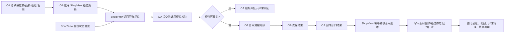
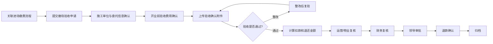
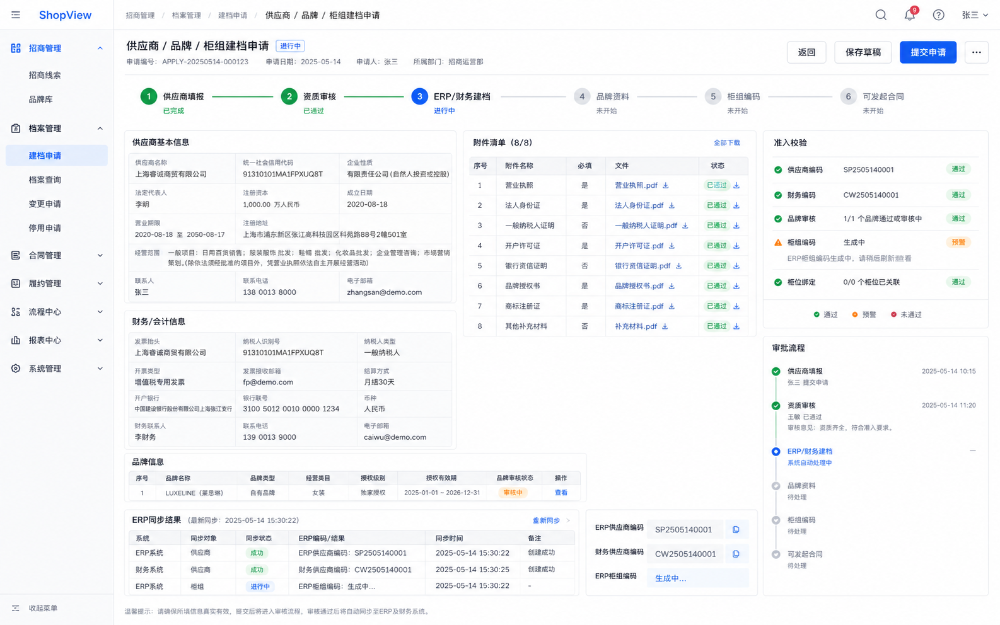
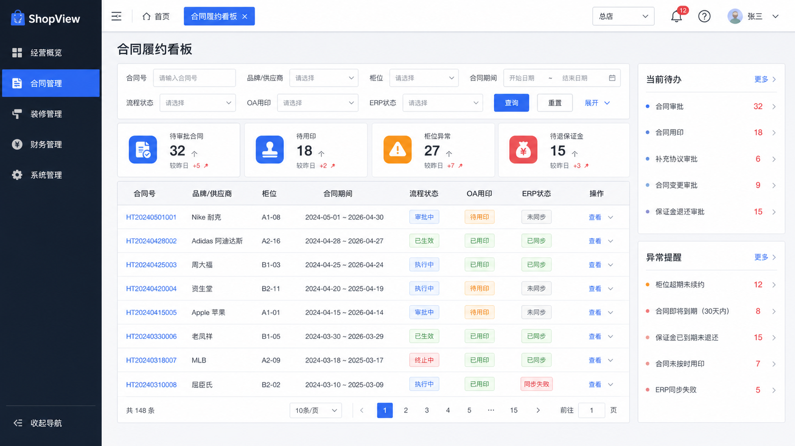
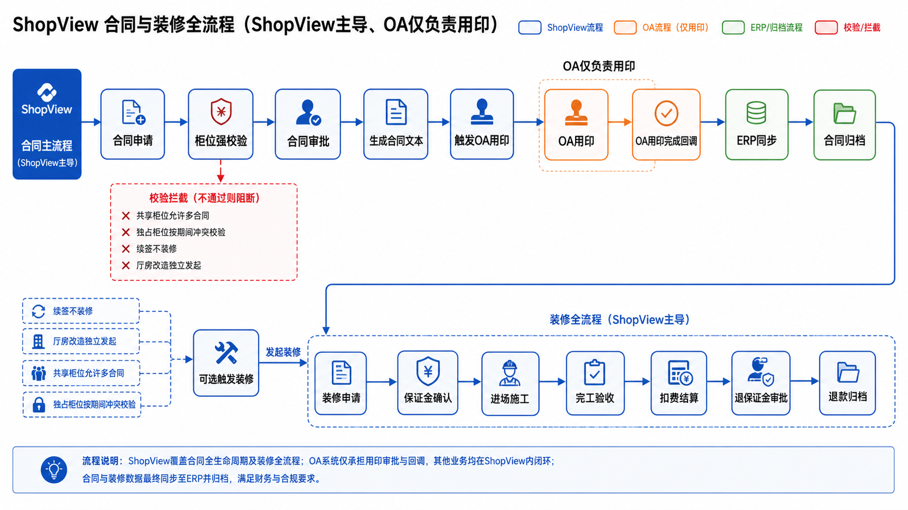
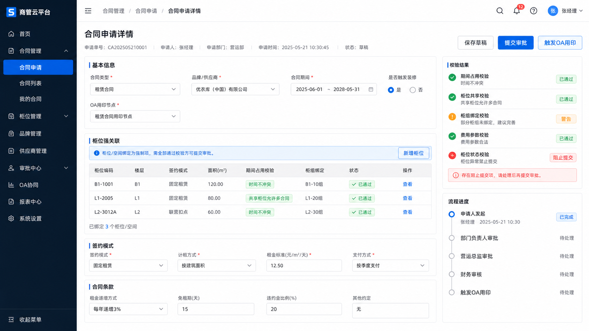

# 合同与装修履约流程迁移代办

## 1. 目标边界

> 2026-05-30 沟通后更新：当前合同链路以 OA 为主流程，ShopView 不承接供应商建档、品牌建档、柜组建档、合同申请、合同审批、合同文本生成和 OA 用印流程。

当前 ShopView 合同模块的边界：

- 维护柜位/经营单元主数据和状态。
- 向 OA 提供柜位编码选择和提交前校验能力。
- 柜位编码不存在、状态异常、禁用、删除、楼层/门店归属缺失时，OA 合同流程不允许继续。
- OA 合同流程结束后，通过接口向 ShopView 回传合同结果和归档信息。
- ShopView 接收合同副本，维护合同与 `business_units` / `business_unit_binding` 的关联，用于台账、地图、装修、异常治理和分析展示。

不在当前开发范围内：

- 供应商信息填报、审批和 ERP/财务建档。
- 品牌信息填报、授权资料审批和品牌编码生成。
- 品牌柜组新增流程和柜组编码生成。
- 合同申请、合同审批、合同文本生成、OA 用印发起。
- ShopView 主动推送供应商、品牌、柜组、合同到 ERP。

本文后半部分保留 OA 字段、ERP 存储过程和旧流程拆解，仅作为接口映射、验收和排障参考，不作为当前开发代办。

## 2. 总体流程



## 3. 核心业务规则

### 3.1 OA 前置建档参考

供应商、品牌、柜组和合同生成继续在 OA 内完成。以下内容仅用于理解 OA 合同回传字段来源，不作为 ShopView 当前开发范围。

前置流程：

- 供应商信息填报：基础资料、证照资料、联系人、结算账户、开票资料。
- 供应商附件上传：营业执照、法人/授权资料、开户许可证或账户证明、税务资料、品牌授权、特殊资质等。
- 供应商资质审核审批：营运、招商、财务、法务或管理层按模板审批。
- ERP 及财务系统生成供应商编码和供应商主数据。
- 品牌资料填报：品牌名称、品类、经营方式、授权链路、品牌附件。
- 品牌资料审核审批。
- 品牌通过后发起品牌柜组新增流程。
- ERP 生成柜组编码。

合同准入条件：

- 必须已有有效供应商编码。
- 必须已有有效柜组编码。
- 供应商、品牌、柜组、柜位之间的关系必须清晰可追溯。
- 供应商或品牌资料审批未完成时，不能提交合同审批。
- ERP/财务建档失败或编码缺失时，合同只能保存草稿，不能进入审批。

OA 现有 3 个前置流程需要拆开承接：

- 供应商信息填报：维护供应商名称、联系人、电话、开户行、银行账号、币种、营业执照编码、开户地址、企业信用等级、所属省市、既往重点合作经验、供应商状态，并上传营业执照、开户许可证等附件。
- 品牌信息填报：维护品牌名称、供应商、商标注册证、商标拥有商、商标注册证有效期、商标拥有商有效期、产品合格证、质量检测报告、进口/特殊商品许可证、授权经销商明细和品牌授权书附件；流程中已有品牌编码、流程编号、发起人、发起部门、发起日期、标题。
- 品牌柜组新增流程：在品牌基础上生成经营柜组，维护供应商、柜组名称、部门名称/编码、区域、类别、楼栋、楼层、面积、新引进品牌性质、门店名称/编码、柜组编码、经营方式、品牌等级、是否特卖、品牌跟进开始日期、已开商场/专卖店等经营信息。

因此 ShopView 当前不建设供应商申请、品牌申请、柜组申请和合同申请页面。合同模块只消费 OA/ERP 已生成的供应商、品牌、柜组、合同结果，并把柜位编码作为合同前置校验条件。

### 3.2 合同与柜位强关联

- OA 发起新合同、续签、变更合同时必须选择 ShopView 提供的经营单元/柜位编码。
- 不能只存柜位编码文本，必须存 `business_unit_id`。
- 合同可以绑定一个或多个柜位。
- 绑定时冗余柜位编码、楼层、门店、柜组、面积，便于历史追溯。
- 没有柜位、柜位失效、柜位异常、柜位未绑定有效 ERP 柜组编码时，ShopView 校验接口返回不通过，OA 不能继续提交合同流程。

### 3.3 续签合同允许签未来期间

不能用“柜位当前经营中”直接阻断合同。ShopView 给 OA 的校验应按合同日期区间判断。

允许场景：

- 旧合同：2026-01-01 至 2026-05-31，当前经营中。
- 新合同：2026-06-01 至 2026-12-31。
- 日期不重叠，应允许提交。

冲突判断：

```sql
existing.start_date <= new.end_date
AND existing.end_date >= new.start_date
```

只要同柜位、同签约模式下存在日期重叠的有效合同或审批中合同锁定，才阻断。

### 3.4 共享柜位允许多合同

负一楼超市、集合店、共享经营空间不能按“一柜位同期间只能一份合同”处理。

建议给经营单元增加签约模式：

- `EXCLUSIVE`：独占签约，同一期间只能一份有效合同。
- `SHARED`：共享签约，同一期间允许多份合同。

共享柜位不拦多合同，但必须校验：

- 柜位本身有效。
- 柜位有门店、楼层、柜组归属。
- 柜组编码有效且与当前供应商/品牌关系匹配。
- 同供应商、同品类、同期间是否重复签约。
- 面积分摊或比例是否超额。
- 子合同日期不能超出主合同日期。
- ERP 必填字段完整。

### 3.5 合同与装修解耦

不是所有合同都触发装修：

- 新品牌进场合同：通常触发装修。
- 老合同续签：通常不触发装修。
- 合同不变的厅房改造：可独立发起装修流程。

OA 回传合同结果时建议带上装修触发字段，ShopView 只记录和引用，不承接合同申请：

- `fitout_required`
- `fitout_trigger_mode`: `AUTO` / `MANUAL` / `NONE`
- `fitout_reason`: `NEW_STORE` / `BRAND_UPGRADE` / `RELOCATION` / `RENEWAL_NO_FITOUT` / `OTHER`

装修项目建议支持：

- `source_type`: `CONTRACT` / `MANUAL` / `HALL_RENOVATION` / `UNIT_RENOVATION`
- `source_contract_id`
- `source_contract_no`
- `fitout_scope_type`: `UNIT` / `HALL` / `FLOOR` / `PUBLIC_AREA`

### 3.6 OA 主流程与 ShopView 协同

合同审批、合同文本生成、OA 用印、ERP 同步、合同归档由 OA/ERP 主流程管理。

ShopView 与 OA 的协同点：

- OA 表单选择柜位编码时，调用 ShopView 柜位列表接口。
- OA 合同提交前，调用 ShopView 柜位校验接口。
- OA 流程结束后，调用 ShopView 合同回传接口。
- ShopView 记录 OA 流程号、合同号、柜位绑定、合同状态、归档文件和回传日志。
- ShopView 不触发 OA 用印，不生成合同文本，不主动推送合同到 ERP。

### 3.7 装修进撤场按 OA 费用口径承接

OA 现有装修进场流程是“百货营运-22、品牌进(撤)场施工保证金及费用缴纳流程”，核心字段应在 ShopView 保留：

- 基本信息：标题、流程编号、发起人、发起部门、发起日期、合同类型、施工类型、撤场施工类型。
- 合同信息：富基合同编号、品牌名称、经营方式、门店名称/编码、柜组名称/编码、部门名称/编码、区域、类别、楼栋、楼层、面积、原柜位编号、合同开始/结束日期、供应商名称、开户行、银行账号、管理费单价、租金单价。
- 图纸审核：装修全套图及审批表。
- 施工单位信息：施工单位名称、开户行、账号、负责人、电话、施工安全管理协议及协议 5 份、缴款凭证。
- 费用缴纳：零售施工保证金、特业施工保证金、施工证工本费、施工证保证金、围挡及其他费用。

OA 现有装修撤场流程是“百货营运-23、品牌进(撤)场施工验收及保证金退还流程”，应与进场流程强关联：

- 基本信息必须关联原进场缴费流程，保留开具收款凭证类型。
- 合同信息沿用品牌、柜组、供应商、门店、合同期间和原柜位编号。
- 施工单位信息增加是否委托施工、委托授权书。
- 开业前验收确认记录是否安装电表、照明功率、其他功率、实际面积、电费金额、能耗费金额、综合管理费金额、电费总额、违规罚款金额、罚款原因。
- 施工验收确认上传施工验收确认单、现场交底、电工交底、会议纪要、过程隐蔽验收等附件。
- 退还明细至少支持收取标准、实收金额、实际开始/结束时间、施工天数、管理费扣款、水电费扣款、施工罚款、装修指引工本费、合计应收金额、退还金额。

装修进场审批节点从 OA 页面识别为：品类部发起、物业填写、运营审核、分管总审批、集团财务审批、物业补充。供应商、品牌、柜组流程当前示例均为发起人提交后上级领导批准并抄送。

### 3.8 OA 合同字段按租赁/非租赁拆分

OA 现有合同流程至少分为两套：

- 百货租赁合同流程：示例标题为“营运类-百货租赁合同-续签”，对应 `Approveam_cnt`。核心是租赁期限、收银方式、租金/管理费、首期缴纳、周期费用、一次性或费率费用。
- 百货非租赁合同流程：示例标题为“营运类-百货非租赁合同-续签”，对应 `Approvecont`。核心是经营方式、目标销售、扣率、经营范围、保底分解和合同费用。

ShopView 当前不做合同申请页，但 OA 回传和 ShopView 展示需要识别合同大类：

- `LEASE`：租赁合同。
- `NON_LEASE`：非租赁合同，覆盖经销、成本代销、扣率代销、联营。

两类合同复用供应商、品牌、柜组、柜位、合同期间、签约方、文件和用印信息，但费用结构和 ERP 入参不同。

## 4. 数据模型建议

当前优先模型：

- `business_units`：柜位/经营单元主数据，作为 OA 选择柜位编码的数据源。
- `business_unit_contract_modes`：柜位签约模式，表达 `EXCLUSIVE / SHARED`。
- `business_unit_reservations`：合同提交和回传期间的日期区间锁定。
- `business_unit_binding`：合同与柜位、柜组、供应商、品牌的结果关系。
- `oa_contract_callback_logs`：OA 合同回传日志，保存幂等键、原始报文、处理状态和错误原因。
- `contract_unit_exceptions`：合同与柜位异常清单，支撑人工补录和治理。

以下供应商、品牌、柜组、合同申请模型为历史迁移参考，当前不进入开发范围。

### 4.1 供应商、品牌、柜组建档参考

- `supplier_applications`
- `supplier_application_contacts`
- `supplier_application_accounts`
- `supplier_application_attachments`
- `supplier_erp_records`
- `brand_applications`
- `brand_application_attachments`
- `brand_authorization_dealers`
- `brand_erp_records`
- `counter_group_applications`
- `counter_group_application_units`
- `counter_group_erp_records`
- `supplier_brand_relations`
- `supplier_brand_group_relations`
- `supplier_onboarding_logs`

关键字段建议：

- `supplier_application_no`
- `supplier_id`
- `supplier_code`
- `supplier_name`
- `credit_code`
- `finance_supplier_code`
- `erp_supplier_code`
- `brand_id`
- `brand_code`
- `brand_name`
- `trademark_owner`
- `trademark_register_expire_date`
- `trademark_owner_expire_date`
- `category_id`
- `erp_group_code`
- `erp_group_name`
- `store_code`
- `department_code`
- `area_name`
- `floor_name`
- `operation_method`
- `status`: `DRAFT` / `SUBMITTED` / `APPROVING` / `APPROVED` / `ERP_SYNCING` / `READY` / `REJECTED` / `FAILED`

供应商、品牌、柜组分别有自己的 `READY` 状态。这一规则由 OA/ERP 主流程处理；ShopView 当前只在 OA 回传后展示结果。

### 4.2 合同申请参考

- `contract_applications`
- `contract_application_units`
- `contract_terms`
- `contract_documents`
- `contract_integration_jobs`
- `oa_seal_requests`
- `contract_archive_files`
- `contract_operation_logs`

OA 合同回传建议冗余保存：

- `supplier_application_id`
- `supplier_id`
- `supplier_code`
- `brand_id`
- `brand_code`
- `brand_name`
- `counter_group_application_id`
- `erp_group_code`
- `erp_group_name`
- `business_unit_id`

### 4.3 柜位占用与锁定

- `business_unit_contract_modes`
- `business_unit_reservations`

`business_unit_reservations` 用日期区间锁定，不要整体锁死柜位。

字段建议：

- `business_unit_id`
- `source_type`: `OA_CONTRACT_VALIDATION` / `OA_CONTRACT_CALLBACK` / `MANUAL_FIX`
- `source_id`
- `start_date`
- `end_date`
- `status`: `ACTIVE` / `RELEASED`

### 4.4 通用流程参考

现有装修流程已经有 `workflow_templates / workflow_instances / workflow_instance_nodes / workflow_actions`，建议抽象成通用流程。

关键调整：

- 从 `project_id` 绑定，改为 `business_type + business_id`。
- `business_type` 当前优先支持 `OA_CONTRACT_CALLBACK`、`DECORATION_DEPOSIT`、`DECORATION_REFUND`。
- `SUPPLIER_ONBOARDING`、`BRAND_ONBOARDING`、`COUNTER_GROUP_ONBOARDING`、`CONTRACT_APPLICATION` 只作为历史参考，不进入当前开发。

## 5. OA 流程字段参考

本章保留 OA 现有流程结构，方便后续字段对照。ShopView 当前不承接这些审批模板。

### 5.1 供应商、品牌与柜组建档流程参考


OA 侧实际落地建议拆成 3 个模板，而不是一个长模板：

- 供应商信息填报：发起人提交 -> 上级领导审批/抄送 -> 供应商基础档案待 ERP/财务建档。
- 品牌信息填报：选择已通过供应商 -> 上传商标注册、授权、产品/质量/进口/特殊资质 -> 上级领导审批 -> 生成品牌编码或确认品牌状态。
- 品牌柜组新增：选择已通过品牌和供应商 -> 填门店、部门、区域、类别、楼栋、楼层、面积、经营方式、特卖等字段 -> 上级领导审批 -> ERP 生成柜组编码。

### 5.2 合同审批流程参考


### 5.3 装修保证金与进场流程


### 5.4 验收退保证金流程



## 6. 页面设计图参考

以下为旧方案概念图，仅保留视觉和字段参考；当前页面代办以第 7 章为准。

### 6.1 供应商、品牌、柜组建档申请



### 6.2 合同履约看板



### 6.3 合同申请详情与柜位校验



### 6.4 合同、OA、ERP、装修流程图



## 7. 页面代办

### 7.1 柜位选择与状态维护

- [ ] 经营单元页面补齐 OA 可选字段：柜位编码、门店、楼层、面积、状态、是否可签约、不可签约原因。
- [ ] 柜位状态需要明确 `ACTIVE / VACANT / FITOUT / INACTIVE / ABNORMAL / DELETED` 等枚举的签约规则。
- [ ] 支持按门店、楼层、柜位编码、状态筛选可供 OA 选择的柜位。
- [ ] 柜位详情展示当前合同、历史合同、OA 流程号、合同期间和绑定来源。

### 7.2 合同台账与详情

- [ ] 合同列表展示合同号、OA 流程号、供应商、供应商编码、品牌、柜组编码、柜位编码、合同期间、合同状态、回传状态、归档状态。
- [ ] 支持按门店、楼层、柜位、柜组、供应商、品牌、合同状态、OA 流程号筛选。
- [ ] 合同详情展示 OA 回传原始字段、归档附件、回传时间、幂等键、最近一次回传结果。
- [ ] 合同详情展示关联 `business_unit_id`，不能只展示柜位编码文本。
- [ ] 地图点击柜位时展示当前有效合同和历史合同。

### 7.3 OA 回传与异常治理页面

- [ ] 展示 OA 合同回传日志：成功、失败、重复、字段缺失、柜位无法匹配。
- [ ] 展示柜位异常清单：编码不存在、柜位停用、状态异常、楼层/门店归属缺失。
- [ ] 展示合同异常清单：OA 回传合同缺柜位、柜位编码无法匹配、合同期间冲突、共享柜位面积/比例超额。
- [ ] 支持人工补充或修正合同与柜位绑定，并保留操作日志。
- [ ] 支持失败回传重试和错误详情查看。

### 7.4 装修项目页面

- [ ] 支持合同触发装修。
- [ ] 支持独立发起厅房/柜位/公共区域装修。
- [ ] 施工空间必填，合同可选。
- [ ] 保证金缴纳、财务确认、进场确认、施工、验收、退款全流程展示。
- [ ] 关联合同、柜位、供应商、品牌和归档资料。
- [ ] 进场流程展示图纸审核、施工单位、施工保证金、施工证工本费、施工证保证金、围挡及其他费用。
- [ ] 撤场流程必须能关联原进场流程，并展示验收确认、费用扣减、退还金额。
- [ ] 如果来源为 OA 回传合同，装修项目只引用合同结果，不反向驱动合同流程。

## 8. 后端接口代办

- [ ] `GET /api/integrations/oa/business-units/options` 给 OA 返回可选柜位编码。
- [ ] `POST /api/integrations/oa/contracts/validate-unit` OA 合同提交前校验柜位。
- [ ] `POST /api/integrations/oa/contracts/callback` OA 流程结束后回传合同结果。
- [ ] `GET /api/integrations/oa/contracts/callback-logs` 查询 OA 回传日志。
- [ ] `POST /api/integrations/oa/contracts/callback-logs/{id}/retry` 重试失败回传。
- [ ] `POST /api/contracts/{contract_no}/unit-bindings` 人工补充或修正合同柜位绑定。
- [ ] `GET /api/contracts/exceptions` 查询合同与柜位异常清单。
- [ ] `POST /api/decoration-projects/from-contract/{contract_no}` 从 OA 回传合同生成装修项目。
- [ ] `POST /api/decoration-projects` 独立发起装修项目。
- [ ] `POST /api/decoration-projects/{id}/entry-fees/calculate` 计算进场保证金和费用。
- [ ] `POST /api/decoration-projects/{id}/exit-refund/calculate` 计算撤场扣款和退还金额。

## 9. OA/ERP 字段参考

本章为历史调研资料，保留用于 OA 回传字段映射、ERP 口径核对和异常排查。当前 ShopView 不直接调用这些过程，也不建设对应供应商、品牌、柜组、合同申请流程。

### 9.1 ERP 过程清单

当前 OA 对 ERP 的关键存储过程来自三个文件：

- `manaframe_oa.txt`：`manaframe_oa`，用于品牌厅/柜组新增。传入名称、上级编码、类型、品牌区域、品牌级次、楼栋、楼层、营业面积，返回柜组编码和状态。
- `supband_oa.txt`：`supband_oa`，用于品牌主档和供应商-品牌关系新增。传入供应商名称、品牌名称，返回品牌编码和状态。
- `BBASEINFO_fanwei.txt`：`BBASEINFO_fanwei` 包，包含合同延期、供应商新增、联营合同新增、租赁合同新增。

这些过程目前由 OA/ERP 主流程负责。ShopView 只需要理解其字段来源和结果口径，用于 OA 回传合同后的展示、校验和异常排查。

### 9.2 柜组与品牌厅新增：`manaframe_oa`

入参：

- `ls_name`：名称，OA 柜组新增流程里的柜组名称/品牌名称。
- `ls_pid`：柜组上级编码。
- `ls_type`：类型，`N` 为柜组，`Y` 为商铺。
- `ls_area`：品牌区域编码。
- `ls_ppjc`：品牌级次。
- `ls_ld`：楼栋。
- `ls_lc`：楼层。
- `ls_yymj`：营业面积。

返回：

- `out_mfid`：ERP 柜组编码。
- `out_status`：`Y/N`，表示 ERP 侧是否生成成功。

过程行为：

- 先写 `oa_mana_log`。
- 如果 `MANABRAND.MBCNAME = ls_name` 已存在，则复用品牌厅编码；否则按 `ls_area` 下最大 `mbid + 1` 生成品牌厅编码，并调用 `sp_updatemanabrand`。
- 柜组编码按 `manaframe.mfcode like ls_pid || '%'` 取最大值加 1。
- 调 `sp_updatemanaframe_oa` 写入 ERP 柜组。
- 成功后同步 `dbusrmkt.manaframe@m01`、门店/总部 `operseachrange` 数据范围，以及 `VIEW_MFRAME_ALL@m01` 组织机构视图。

参考要点：

- OA/ERP 侧需要保存传给 `manaframe_oa` 的所有入参、返回柜组编码、返回状态、错误信息、调用时间。
- 品牌申请通过后先调用 `supband_oa` 建立 `codebrand` 和 `supplierpp`；柜组新增时如果 ERP 品牌厅不存在，再由 `manaframe_oa` 补建 `MANABRAND`。
- ERP 返回 `out_status='Y'` 且 `out_mfid` 非空后，柜组才可进入 `READY`。

### 9.3 品牌新增和供应商-品牌绑定：`supband_oa`

入参：

- `ls_supname`：供应商名称。
- `ls_bandname`：品牌名称。

返回：

- `out_bandid`：ERP 品牌编码，对应 `codebrand.cbid`。
- `out_status`：状态，过程里 `1` 表示成功或已存在，`0` 表示失败。

过程行为：

- 按供应商名称从 `supplierbase` 查 `sbid`。
- 如果该供应商在 `supplierpp` 中已存在同名品牌关系，则直接返回成功。
- 如果 `codebrand.cbcname = ls_bandname` 已存在，则复用最大 `cbid`。
- 如果品牌主档不存在，则按 `max(cbid)+1` 生成品牌编码，并调用 `sp_updatecodebrand` 写入 `codebrand`。
- 写入 `supplierpp(supid, scbid, scbname, scmaint, scchannel)`，建立供应商和品牌关系。

参考要点：

- OA/ERP 侧需要保存 `ls_supname`、`ls_bandname`、`out_bandid`、`out_status`、错误信息和调用时间。
- 调用前必须确认供应商已通过 `Approvesupplierbase` 写入 `supplierbase`，否则 `supband_oa` 查不到供应商。
- `supband_oa` 只按供应商名称匹配供应商，OA/ERP 侧应优先用供应商编码锁定供应商，再传 ERP 当前需要的供应商名称，避免重名供应商导致多次循环写入。
- `out_bandid` 回写为 `brand_code`。联营合同 `Approvecont.p_cmbrand` 必须使用这个品牌编码。
- 品牌申请的资质、授权、有效期仍由 OA 管理；ERP 过程只负责 `codebrand` 和 `supplierpp`。

### 9.4 供应商新增：`BBASEINFO_fanwei.Approvesupplierbase`

入参：

- `p_subject`：财务核算代码。
- `p_sbname`：供应商名称。
- `p_dz`：店招。
- `p_regcode`：地区。
- `p_taxrate`：税率。
- `p_wmid`：经营方式，`0` 为经销/成本代销/扣率代销/联营供应商，`1` 为租赁租户。
- `p_taxno`：纳税号。
- `p_bank`：开户银行。
- `p_bankno`：银行账号。
- `p_mkt`：所属门店，当前限制 `601/602/603/604`。
- `p_sbid`：供应商编码。
- `p_email`：供应商邮箱。

返回：

- `o_ret`：`0` 成功，`1` 失败。
- `o_retmsg`：结果说明或失败原因。

过程行为：

- 校验门店编码、供应商编码是否重复。
- `p_wmid='0'` 时走供应商建档，写 `Bsupplierbase`、`Supplierbase`、默认 `Supplierpp`，并下发 `Cmdsend.Sp_Cmdsend_All('SUPBASEADD', ...)`。
- `p_wmid='1'` 时走租户建档，写 `Supplierbase`，并写入 `Mallsupmkt` 的 601/602/603/604 门店关系。

参考要点：

- OA/ERP 侧需要区分联营供应商和租赁租户，保存 `p_wmid`。
- 提交 ERP 前必须校验门店、供应商编码唯一性、税号、开户行、账号、财务核算代码。
- 调用成功后回写 `supplier_code`、财务核算代码、ERP 返回消息和 `READY` 状态。

### 9.5 联营/经销类合同新增：`BBASEINFO_fanwei.Approvecont`

适用范围：

- 供应商合同新增，覆盖经销、成本代销、扣率代销、联营等 `cmwmid in ('1','2','3','4','5')` 的合同口径。

关键入参：

- `p_cmbillno`：OA/ShopView 合同申请单号。
- `p_cmtype`：合同类型。
- `p_cmsupid`：供应商编码。
- `p_cmwmid`：经营方式。
- `p_cmtitle`：积分定义，过程要求 `0/1/2/3/4`。
- `p_cmeffdate`、`p_cmlapdate`：合同生效/失效日期。
- `p_cmweek5`：保底方式。
- `p_cmyfkmode`：超额方式。
- `p_cmsetmode`：经销结算方式。
- `p_cmjsmkt`：结算位置。
- `p_cmkl`：扣率。
- `p_cmsettletype`：是否清算。
- `p_cmfmfid`：柜组编码。
- `p_cmbrand`：品牌编码。
- `p_cmfnum1` 至 `p_cmfnum6`：扣率字段。
- `p_cmfjzmj`、`p_cmfsymj`：契约面积、实际面积。
- `p_fymx`：费用明细，格式为 `费用代码,金额,结算方式;`。

过程行为：

- 先写 `oa_cont_log`。
- 校验申请单号不能重复、供应商编码存在、经营方式合法、柜组编码存在、品牌编码存在、柜组能匹配合同类型。
- 写 `bcontmain`、`bcontmanaframe`，生成正式合同号后写 `contmain`、`contmanaframe`。
- 费用明细会自动追加 `93/94/95/96` 四类默认费用，再写 `bcontsupcharge` 和 `contsupcharge`。
- 下发 `Cmdsend.Sp_Cmdsend_All('CONT', ...)`，更新 `bcontmain` 审核状态，调用 `Sp_Contstatus` 生效合同。
- 如果积分定义不为 `0`，会向 CRM `RULEJFRATE@crm` 写积分规则。

参考要点：

- OA 合同申请必须保存 `cmbillno`，且这个编号要全局唯一，不能重复调用。
- 合同申请提交 ERP 前要先确认供应商、柜组、品牌都已在 ERP 存在。
- 费用明细要结构化存储，再按 ERP 要求序列化为 `p_fymx`。
- 非租赁合同的 OA 字段需要映射到 `p_cmkl`、`p_cmfnum1` 至 `p_cmfnum6`、`p_cmweek5`、`p_cmyfkmode`、`p_cmsettletype` 和 `p_fymx`。
- 目标销售、保底分解、扣率文本、特卖收益目前不都在 `Approvecont` 入参中体现，OA 回传时应明确哪些字段进入 ERP，哪些字段只作为合同文本/审批留痕。
- ERP 返回 `o_contno` 后回写正式合同号，并把合同申请状态置为 `ERP_SYNCED/ARCHIVABLE`。

### 9.6 租赁合同新增：`BBASEINFO_fanwei.Approveam_cnt`

适用范围：

- 租赁合同新增，ERP 内部固定 `cmwmid='5'`。

关键入参：

- `p_cmbillno`：合同申请单号。
- `p_cmsupid`：租户编码。
- `p_cmtitle`：主题。
- `p_cmmfid`：主商位/柜组。
- `p_cmeffdate`、`p_cmlapdate`：合同生效/失效日期。
- `p_cmpostype`：收银方式，`0` 自主收银，`1` 统一收银，`2` 租用 POS。
- `p_cmtqmon`：提前几月。
- `p_cmjmon`：月结日。
- `p_cmzljl`：滞纳金率。
- `p_cmzcfkr`：缴款期限。
- `p_cmzczdrts`：滞纳金计算方式。
- `p_yszq1`、`p_yszq2`、`p_yszq3`：预收租金、预收管理费、预收推广费。
- `p_settlegroup`：结算组。
- `p_zjcc`：租金与抽成，格式为 `开始日期,结束日期,结算方式,租金单位,租金单价,管理费单位,管理费单价,抽成比例;`。
- `p_zqfy`：周期费用，格式为 `开始日期,结束日期,费用项目,单位,单价,金额,收取方式,每次抽取月数;`。
- `p_htfy`：合同费用，格式为 `开始日期,结束日期,费用项目,扣款期限,比例/金额;`。
- `p_httype`：合同类型。

过程行为：

- 校验供应商、柜组、`ba_shop` 商铺存在。
- `p_httype='3'` 时会把 `ba_shop.kind` 改为广告柜组。
- 校验柜组类型与合同类型匹配。
- 生成正式合同号，写 `contmain`、`contmanaframe`。
- 拆解 `p_zjcc` 写 `contbd`，拆解 `p_zqfy` 写 `contcyclist`，拆解 `p_htfy` 写 `contsupcharge`。
- `p_httype=1` 时会自动补 `B1/B2/B3/B4/93/94/95/96` 默认合同费用。
- 调 `mallcontmain.Leaseapprove` 审核租赁合同，并下发 `Cmdsend.Sp_Cmdsend_All('CONT', ...)`。

参考要点：

- OA 租赁合同页面要单独维护租金与抽成、周期费用、合同费用三组明细。
- `business_unit` 与 ERP `ba_shop.id` 的映射必须可靠，否则租赁合同无法推送。
- 合同类型为广告柜组时，要明确是否允许 OA 触发 ERP 侧 `ba_shop.kind` 修改。
- 租赁合同的首期租金/管理费、装修期费用、签约方信息、文件和用印信息，未全部进入 `Approveam_cnt` 入参，OA 回传时应区分 ERP 字段和合同文本/审批留痕字段。
- 租金及管理费明细映射为 `p_zjcc`，周期费用映射为 `p_zqfy`，一次性或费率费用映射为 `p_htfy`。

### 9.7 合同延期：`BBASEINFO_fanwei.updatecont`

入参：

- `p_contno`：合同号。
- `p_edate`：新的结束日期。

返回：

- `o_ret`、`o_retmsg`。

过程行为：

- 校验合同存在。
- 新结束日期不能早于原 `cmlapdate`。
- 租赁合同会检查同商位在新结束日期前是否存在生效合同冲突。
- 更新 `contmain.cmlapdate`，必要时把合同状态改为 `Y`，并同步更新结束日相同的 `contsupcharge.csclapdate`。
- 下发 `Cmdsend.Sp_Cmdsend_All('CONT', ...)`。

参考要点：

- 合同延期不应直接改 ShopView 本地日期后再同步，而应由 OA/ERP 主流程处理；ShopView 接收最终合同状态和日期结果。
- 延期成功后重新拉取合同主表和费用表，保证 ShopView 展示与 ERP 一致。

### 9.8 ERP 字典表口径初查

已从当前合同台账代码和当前数据库初步确认：

- 经营方式 `cmwmid`：`1=经销`、`2=成本代销`、`3=扣率代销`、`4=联营`、`5=租赁`。当前合同台账前端和结算单页面均按这套映射展示。
- 合同类型 `cmtype`：当前合同台账接口会左连接 `contmaintype(cmtypecode, cmtypename)` 获取 `contract_type_name`。但当前数据库的 `contmaintype` 数据明显不只是标准合同类型，除 `1=联营` 外，还混有大量部门/品类名称，例如 `A=6010101 中心一部名品`、`B=6010102 中心四部男装`。合同申请页不能只把 `contmaintype` 当纯字典，需要按 ERP 现有逻辑“柜组 -> 合同类型”校验。
- 租赁合同类型：`contmain.cmsptype` 表注释为 `S=商位 G=广告位 Z=展位 B=百货`，但 `Approveam_cnt.p_httype` 当前传入并写到 `cmtype/cmsptype`，实际数据里主要出现 `1/3/B`，其中过程里 `p_httype='3'` 会把 `ba_shop.kind` 改为广告柜组。这里还需要业务确认 `p_httype` 与 `cmsptype` 的真实映射。
- 收银方式：`Approveam_cnt.p_cmpostype` 注释为 `0=自主收银`、`1=统一收银`、`2=租用POS`；`contmain.cmpostype` 表注释为 `Y=代收银 / N=自收银`。当前数据实际有 `0/1/Y`。说明 OA 接口口径和表注释存在差异，页面需要按合同来源或实际 ERP 规则处理。
- 结算组 `settlegroup`：当前数据出现 `01/02/03/04`，存储过程注释为 `01=新世纪`、`02=百货大楼`、`03=购物中心`、`04=半山书局`。
- 供应商费用结算方式 `contsupcharge.cscismcjs`：当前合同详情前端按 `0=每次`、`1=一次` 展示。
- 供应商费用代码：当前库没有 `codecharge` 表，但 `contsupcharge` 冗余了 `cscchargename`，合同详情直接展示费用名称。默认追加费用在当前数据中的名称为：
  - `93=瑞祥卡3%`
  - `94=瑞祥卡1%`
  - `95=旅通卡1.25%`
  - `96=旅通卡4%`
  - `B1=返券用券费用分摊`
  - `B2=返券费用分摊`
  - `B3=用券费用分摊`
  - `B4=付款方式费用分摊`
- 保底方式 `cmweek5`：结算存储过程注释为 `1=毛利保底`、`2=销售保底`。
- 超额方式 `cmyfkmode`：`CONTBD` 表注释里可见超额方式为 `1=全额`、`2=差额`，当前 `contmain.cmyfkmode` 实际出现 `1/2/#`。

仍需补充或确认：

- `cmtype/contmaintype` 是否应作为“合同类型字典”，还是当前 ERP 实际上用它表达“签订部门/品类合同类型”。
- `p_httype` 与 `contmain.cmsptype`、`ba_shop.kind` 的完整映射。
- `cmpostype` 在租赁合同接口注释 `0/1/2` 与表注释 `Y/N` 之间的转换规则。
- 完整 `codecharge` 费用字典表。如果无法同步 `codecharge`，ShopView 至少要从 `contsupcharge` 历史数据抽取费用代码-名称初始字典。

## 10. 校验代办

- [ ] OA 提交合同前必须传柜位编码、合同开始日期、合同结束日期、合同类型。
- [ ] 柜位编码必须能匹配唯一 `business_units.id`。
- [ ] 柜位必须存在且状态允许签约。
- [ ] 柜位不能是 `INACTIVE / ABNORMAL / DELETED`。
- [ ] 柜位必须有门店和楼层归属。
- [ ] 如果 OA 传柜组编码，需校验柜位与柜组编码关系是否可接受；不能确认时返回告警或阻断，由业务确认规则。
- [ ] `EXCLUSIVE` 柜位按合同期间判断冲突。
- [ ] `SHARED` 柜位允许多合同，但校验面积、比例、供应商或品类重复规则。
- [ ] OA 回传合同必须带幂等键，优先使用 `oa_flow_no`，其次使用 `contract_no + source_system`。
- [ ] OA 回传合同必须带至少一个柜位编码或柜位绑定明细；缺失时进入异常清单。
- [ ] OA 回传合同的柜位编码无法匹配时，不能静默丢弃，必须记录失败日志和错误原因。
- [ ] OA 回传重复请求必须幂等更新，不重复创建合同和柜位绑定。
- [ ] 合同提前终止、延期、作废时，OA/ERP 回传的最终状态和日期参与后续冲突判断。
- [ ] 装修进场前，必须完成图纸审核、施工单位信息、保证金/费用应缴金额和缴款凭证。
- [ ] 装修撤场退款前，必须关联原进场流程并完成验收确认和扣款明细计算。

## 11. 分期建议

### 第 1 期：OA 柜位校验打底

- [ ] 明确柜位状态枚举和是否允许签约规则。
- [ ] 增加经营单元签约模式和日期区间冲突判断。
- [ ] 增加 OA 接口认证、签名、时间戳和重放校验。
- [ ] 增加 OA 柜位选择接口。
- [ ] 增加 OA 合同提交前柜位校验接口。
- [ ] 增加校验日志，记录入参、结果、错误码和调用方。

### 第 2 期：OA 合同回传承接

- [ ] 增加 OA 合同回传接口。
- [ ] 增加合同回传日志表或集成任务表，记录幂等键、原始报文、处理状态和错误原因。
- [ ] 回传后写入合同副本或更新现有 ERP 合同台账补充字段。
- [ ] 回传后维护 `business_unit_binding`，建立合同与柜位关系。
- [ ] 支持回传失败重试和人工补偿。
- [ ] 做历史合同柜位异常扫描。

### 第 3 期：合同展示与异常治理

- [ ] 合同列表增加 OA 流程号、回传状态、柜位绑定状态。
- [ ] 合同详情展示 OA 回传字段、归档附件和处理日志。
- [ ] 地图点击柜位展示当前合同和历史合同。
- [ ] 增加柜位异常、合同缺柜位、冲突合同、回传失败看板。

### 第 4 期：装修与保证金

- [ ] 合同自动/手动触发装修。
- [ ] 独立发起厅房/公共区域装修。
- [ ] 保证金缴纳确认。
- [ ] 进场施工管理。
- [ ] 完工验收。
- [ ] 撤场验收、扣费结算。
- [ ] 退保证金审批与退款归档。

### 第 5 期：通知和移动端

- [ ] 统一待办中心。
- [ ] 企业微信通知。
- [ ] 手机审批页面。
- [ ] 催办、抄送、操作日志。
- [ ] 管理驾驶舱和异常治理看板。

## 12. 与现有项目的衔接点

- 复用当前合同台账接口，继续作为 ERP 合同结果查询层。
- 复用当前业务范围权限，合同、装修、结算都按门店、部门、柜组过滤。
- 复用 `business_units` 作为 OA 合同选择柜位的主数据来源。
- 复用 `business_unit_binding` 维护 OA 回传合同与柜位关系。
- 合同模块只消费 OA/ERP 已建档完成的供应商编码、品牌编码、柜组编码和合同结果。
- 新增 OA 集成层，不把 OA 签名、幂等、回传日志散落在页面或业务服务里。
- 装修项目保留现有能力，但允许来源为合同或独立发起。
- 合同与装修通过关联关系连接，不做强绑定。
