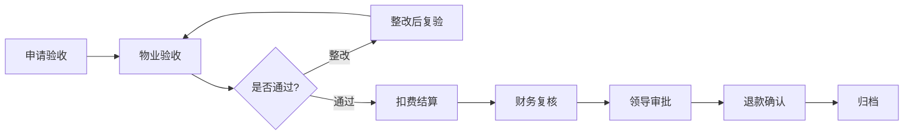

# 合同与装修履约流程迁移代办

## 1. 目标边界

ShopView 作为合同、装修、保证金、验收退款的业务主流程系统；OA 只保留用印流程。

目标流程不是把 OA 表单原样搬过来，而是把合同、柜位、装修、保证金、ERP、OA 用印、归档做成可追溯的业务链路。

## 2. 总体流程

```mermaid
flowchart LR
  S1[供应商信息填报] --> S2[上传供应商附件]
  S2 --> S3[供应商资质审核]
  S3 --> S4[ERP/财务生成供应商编码]
  S4 --> S5[品牌资料填报]
  S5 --> S6[品牌/经营资料审核]
  S6 --> S7[ERP 生成柜组编码]
  S7 --> A[合同申请]
  A --> B[供应商编码/柜组编码/柜位强校验]
  B --> C{校验通过?}
  C -- 否 --> C1[阻断提交并提示异常]
  C -- 是 --> D[合同审批]
  D --> E[生成合同文本]
  E --> F[触发 OA 用印]
  F --> G[OA 用印完成回调]
  G --> H[ERP 同步]
  H --> I[合同归档]
  I --> J{是否需要装修?}
  J -- 新进场/需改造 --> K[生成装修待办]
  J -- 续签不装修 --> Z[合同履约跟踪]
  K --> L[保证金确认]
  L --> M[进场施工]
  M --> N[完工验收]
  N --> O[扣费结算]
  O --> P[退保证金审批]
  P --> Q[退款归档]

  R[厅房/公共区域装修改造] --> K
```



## 3. 核心业务规则

### 3.1 合同前置建档

合同不是第一个流程，合同前必须完成供应商、品牌、柜组建档。

前置流程：

- 供应商信息填报：基础资料、证照资料、联系人、结算账户、开票资料。
- 供应商附件上传：营业执照、法人/授权资料、开户许可证或账户证明、税务资料、品牌授权、特殊资质等。
- 供应商资质审核审批：营运、招商、财务、法务或管理层按模板审批。
- ERP 及财务系统生成供应商编码和供应商主数据。
- 品牌资料填报：品牌名称、品类、经营方式、授权链路、品牌附件。
- 品牌/经营资料审核审批。
- ERP 生成柜组编码。

合同准入条件：

- 必须已有有效供应商编码。
- 必须已有有效柜组编码。
- 供应商、品牌、柜组、柜位之间的关系必须清晰可追溯。
- 供应商或品牌资料审批未完成时，不能提交合同审批。
- ERP/财务建档失败或编码缺失时，合同只能保存草稿，不能进入审批。

### 3.2 合同与柜位强关联

- 新合同、续签、变更合同必须绑定经营单元/柜位。
- 不能只存柜位编码文本，必须存 `business_unit_id`。
- 合同可以绑定一个或多个柜位。
- 绑定时冗余柜位编码、楼层、门店、柜组、面积，便于历史追溯。
- 没有柜位、柜位失效、柜位异常、柜位未绑定有效 ERP 柜组编码时，不能提交合同审批。

### 3.3 续签合同允许签未来期间

不能用“柜位当前经营中”直接阻断合同。应按合同日期区间校验。

允许场景：

- 旧合同：2026-01-01 至 2026-05-31，当前经营中。
- 新合同：2026-06-01 至 2026-12-31。
- 日期不重叠，应允许提交。

冲突判断：

```sql
existing.start_date <= new.end_date
AND existing.end_date >= new.start_date
```

只要同柜位、同签约模式下存在日期重叠的有效合同或审批中合同锁定，才阻断。

### 3.4 共享柜位允许多合同

负一楼超市、集合店、共享经营空间不能按“一柜位同期间只能一份合同”处理。

建议给经营单元增加签约模式：

- `EXCLUSIVE`：独占签约，同一期间只能一份有效合同。
- `SHARED`：共享签约，同一期间允许多份合同。
- `MASTER_SUB`：主合同 + 子合同/补充合同。

共享柜位不拦多合同，但必须校验：

- 柜位本身有效。
- 柜位有门店、楼层、柜组归属。
- 柜组编码有效且与当前供应商/品牌关系匹配。
- 同供应商、同品类、同期间是否重复签约。
- 面积分摊或比例是否超额。
- 子合同日期不能超出主合同日期。
- ERP 必填字段完整。

### 3.5 合同与装修解耦

不是所有合同都触发装修：

- 新品牌进场合同：通常触发装修。
- 老合同续签：通常不触发装修。
- 合同不变的厅房改造：可独立发起装修流程。

合同申请建议增加字段：

- `fitout_required`
- `fitout_trigger_mode`: `AUTO` / `MANUAL` / `NONE`
- `fitout_reason`: `NEW_STORE` / `BRAND_UPGRADE` / `RELOCATION` / `RENEWAL_NO_FITOUT` / `OTHER`

装修项目建议支持：

- `source_type`: `CONTRACT` / `MANUAL` / `HALL_RENOVATION` / `UNIT_RENOVATION`
- `source_contract_id`
- `source_contract_no`
- `fitout_scope_type`: `UNIT` / `HALL` / `FLOOR` / `PUBLIC_AREA`

### 3.6 OA 只做用印

合同审批、合同文本生成、ERP 同步、归档状态由 ShopView 管理。

OA 用印作为外部流程实例：

- ShopView 在合同某节点触发 OA 用印。
- OA 完成后回调 ShopView。
- ShopView 记录用印状态、盖章件、归档文件。

## 4. 建议数据模型

### 4.1 供应商、品牌、柜组建档

- `supplier_applications`
- `supplier_application_contacts`
- `supplier_application_accounts`
- `supplier_application_attachments`
- `supplier_erp_records`
- `brand_applications`
- `brand_application_attachments`
- `brand_erp_group_records`
- `supplier_brand_relations`
- `supplier_onboarding_logs`

关键字段建议：

- `supplier_application_no`
- `supplier_id`
- `supplier_code`
- `supplier_name`
- `credit_code`
- `finance_supplier_code`
- `erp_supplier_code`
- `brand_id`
- `brand_name`
- `category_id`
- `erp_group_code`
- `erp_group_name`
- `status`: `DRAFT` / `SUBMITTED` / `APPROVING` / `APPROVED` / `ERP_SYNCING` / `READY` / `REJECTED` / `FAILED`

`READY` 表示供应商编码、财务资料、品牌资料、ERP 柜组编码都已完成，可进入合同申请。

### 4.2 合同申请

- `contract_applications`
- `contract_application_units`
- `contract_terms`
- `contract_documents`
- `contract_integration_jobs`
- `oa_seal_requests`
- `contract_archive_files`
- `contract_operation_logs`

合同申请建议冗余保存：

- `supplier_application_id`
- `supplier_id`
- `supplier_code`
- `brand_id`
- `brand_name`
- `erp_group_code`
- `business_unit_id`

### 4.3 柜位占用与锁定

- `business_unit_contract_modes`
- `business_unit_reservations`

`business_unit_reservations` 用日期区间锁定，不要整体锁死柜位。

字段建议：

- `business_unit_id`
- `source_type`: `CONTRACT_APPLICATION`
- `source_id`
- `start_date`
- `end_date`
- `status`: `ACTIVE` / `RELEASED`

### 4.4 通用流程

现有装修流程已经有 `workflow_templates / workflow_instances / workflow_instance_nodes / workflow_actions`，建议抽象成通用流程。

关键调整：

- 从 `project_id` 绑定，改为 `business_type + business_id`。
- `business_type` 支持 `SUPPLIER_ONBOARDING`、`BRAND_ONBOARDING`、`CONTRACT`、`DECORATION_DEPOSIT`、`DECORATION_REFUND`。
- 供应商建档、品牌建档、装修、合同、保证金、退款共用流程模板和动作记录。

## 5. 流程模板

### 5.1 供应商与品牌建档流程


### 5.2 合同审批流程


### 5.3 装修保证金与进场流程


### 5.4 验收退保证金流程



## 6. 页面设计图

### 6.1 供应商、品牌、柜组建档申请


### 6.2 合同履约看板


### 6.3 合同申请详情与柜位校验


### 6.4 合同、OA、ERP、装修流程图


## 7. 页面代办

### 7.1 供应商建档页面

- [ ] 供应商基础资料填报。
- [ ] 证照、授权、财务、税务、特殊资质附件上传。
- [ ] 附件必填项按供应商类型、经营品类动态控制。
- [ ] 供应商审批流：业务/招商、财务、法务/管理。
- [ ] ERP/财务建档状态展示：待推送、推送中、成功、失败、重试。
- [ ] 展示 ERP 供应商编码、财务供应商编码和失败原因。

### 7.2 品牌与柜组建档页面

- [ ] 品牌资料填报：品牌、品类、授权链路、经营方式。
- [ ] 品牌附件上传：品牌授权、商标/代理证明、品类资质。
- [ ] 品牌审核审批。
- [ ] ERP 柜组编码生成状态展示。
- [ ] 支持一个供应商多个品牌、一个品牌多个柜组。
- [ ] 柜组编码与供应商、品牌、品类、柜位关系维护。

### 7.3 合同履约看板

- [ ] 展示合同待办、OA 用印、ERP 同步、柜位异常、待退保证金。
- [ ] 支持按门店、楼层、柜组、供应商、品牌、合同状态、用印状态、ERP 状态筛选。
- [ ] 增加异常提醒：无柜位、柜位异常、日期冲突、共享柜位面积超额、ERP 推送失败。
- [ ] 增加前置资料异常提醒：供应商未 READY、缺供应商编码、缺财务编码、缺柜组编码。
- [ ] 合同列表展示合同号、供应商、供应商编码、品牌、柜组编码、柜位、合同期间、流程状态、OA 用印状态、ERP 状态。

### 7.4 合同申请详情

- [ ] 基本信息：合同类型、供应商、供应商编码、品牌、柜组编码、合同期间、结算位置、经营方式。
- [ ] 只能选择 `READY` 状态的供应商/品牌/柜组关系。
- [ ] 柜位强关联：支持绑定多个经营单元。
- [ ] 签约模式：展示 `EXCLUSIVE / SHARED / MASTER_SUB`。
- [ ] 日期冲突校验：按柜位和合同期间判断。
- [ ] 共享柜位校验：面积、供应商、品类、主子合同关系。
- [ ] 是否触发装修：`AUTO / MANUAL / NONE`。
- [ ] 合同文本生成：展示模板版本、生成时间、文件版本。
- [ ] OA 用印：展示发起状态、OA 单号、回调结果、盖章件。
- [ ] ERP 同步：展示推送任务、失败原因、重试入口。

### 7.5 装修项目页面

- [ ] 支持合同触发装修。
- [ ] 支持独立发起厅房/柜位/公共区域装修。
- [ ] 施工空间必填，合同可选。
- [ ] 保证金缴纳、财务确认、进场确认、施工、验收、退款全流程展示。
- [ ] 关联合同、柜位、供应商、品牌和归档资料。

### 7.6 异常治理页面

- [ ] 供应商资料审批未完成清单。
- [ ] ERP/财务供应商建档失败清单。
- [ ] 品牌资料审批未完成清单。
- [ ] 缺 ERP 柜组编码清单。
- [ ] 历史合同柜位缺失清单。
- [ ] 柜位无 ERP 柜组绑定清单。
- [ ] 柜位多合同冲突清单。
- [ ] 共享柜位面积/比例超额清单。
- [ ] 历史合同补柜位、补柜组、补面积入口。

## 8. 后端接口代办

- [ ] `POST /api/supplier-applications` 创建供应商建档申请。
- [ ] `PUT /api/supplier-applications/{id}` 保存供应商草稿。
- [ ] `POST /api/supplier-applications/{id}/attachments` 上传供应商附件。
- [ ] `POST /api/supplier-applications/{id}/submit` 提交供应商审批。
- [ ] `POST /api/supplier-applications/{id}/approve` 供应商审批动作。
- [ ] `POST /api/supplier-applications/{id}/erp-sync` 生成/同步 ERP 及财务供应商信息。
- [ ] `POST /api/brand-applications` 创建品牌/柜组建档申请。
- [ ] `POST /api/brand-applications/{id}/submit` 提交品牌审批。
- [ ] `POST /api/brand-applications/{id}/erp-group-sync` 生成/同步 ERP 柜组编码。
- [ ] `POST /api/contract-applications` 创建合同申请。
- [ ] `PUT /api/contract-applications/{id}` 保存草稿。
- [ ] `POST /api/contract-applications/{id}/validate` 提交前校验。
- [ ] `POST /api/contract-applications/{id}/submit` 提交审批并创建日期区间锁。
- [ ] `POST /api/contract-applications/{id}/approve` 审批动作。
- [ ] `POST /api/contract-applications/{id}/generate-document` 生成合同文本。
- [ ] `POST /api/contract-applications/{id}/oa-seal` 触发 OA 用印。
- [ ] `POST /api/integrations/oa/seal-callback` 接收 OA 用印回调。
- [ ] `POST /api/contract-applications/{id}/erp-sync` 创建 ERP 推送任务。
- [ ] `POST /api/contract-applications/{id}/archive` 归档合同。
- [ ] `POST /api/decoration-projects/from-contract/{contract_application_id}` 从合同生成装修项目。
- [ ] `POST /api/decoration-projects` 独立发起装修项目。

## 9. 校验代办

- [ ] 合同提交前，供应商建档状态必须是 `READY`。
- [ ] 合同提交前，必须存在有效 `supplier_code`。
- [ ] 合同提交前，必须存在有效财务供应商编码或财务系统映射。
- [ ] 合同提交前，品牌资料必须审核通过。
- [ ] 合同提交前，必须存在有效 `erp_group_code`。
- [ ] 合同选择的柜位必须能匹配当前供应商、品牌、柜组关系。
- [ ] 合同必须绑定至少一个 `business_unit_id`。
- [ ] 柜位必须存在且启用。
- [ ] 柜位不能是 `INACTIVE / ABNORMAL / DELETED`。
- [ ] 柜位必须有门店、楼层、柜组归属。
- [ ] 当前用户必须有该柜位业务范围权限。
- [ ] `EXCLUSIVE` 柜位按合同期间判断冲突。
- [ ] `SHARED` 柜位允许多合同，但校验面积、供应商、品类和 ERP 必填字段。
- [ ] `MASTER_SUB` 子合同必须有主合同，且日期不超过主合同。
- [ ] 审批中合同必须创建日期区间锁。
- [ ] 驳回、取消时释放日期区间锁。
- [ ] 提前终止时使用实际终止日参与后续冲突判断。

## 10. 分期建议

### 第 1 期：数据和规则打底

- [ ] 增加供应商建档、品牌建档、附件和 ERP 编码表。
- [ ] 增加供应商/品牌/柜组 `READY` 准入规则。
- [ ] 增加合同申请表和柜位明细表。
- [ ] 增加经营单元签约模式。
- [ ] 增加区间锁表。
- [ ] 做提交前硬校验。
- [ ] 做历史合同柜位异常扫描。

### 第 2 期：合同主流程

- [ ] 供应商信息填报与附件上传。
- [ ] 供应商审批和 ERP/财务建档。
- [ ] 品牌资料填报、审批和 ERP 柜组编码生成。
- [ ] 合同申请页面。
- [ ] 合同审批流程。
- [ ] 合同文本生成与版本留痕。
- [ ] OA 用印触发与回调记录。
- [ ] ERP 推送任务和重试。
- [ ] 合同归档。

### 第 3 期：装修与保证金

- [ ] 合同自动/手动触发装修。
- [ ] 独立发起厅房/公共区域装修。
- [ ] 保证金缴纳确认。
- [ ] 进场施工管理。
- [ ] 完工验收。
- [ ] 扣费结算。
- [ ] 退保证金审批与退款归档。

### 第 4 期：待办和移动端

- [ ] 统一待办中心。
- [ ] 企业微信通知。
- [ ] 手机审批页面。
- [ ] 催办、抄送、操作日志。
- [ ] 管理驾驶舱和异常治理看板。

## 11. 与现有项目的衔接点

- 复用当前合同台账接口，继续作为 ERP 合同结果查询层。
- 复用当前业务范围权限，合同、装修、结算都按门店、部门、柜组过滤。
- 抽象当前装修流程模型，升级为通用 workflow。
- 在合同模块前新增供应商和品牌建档流程，合同模块只消费已经建档完成的供应商编码和柜组编码。
- 装修项目保留现有能力，但允许来源为合同或独立发起。
- 合同与装修通过关联关系连接，不做强绑定。
